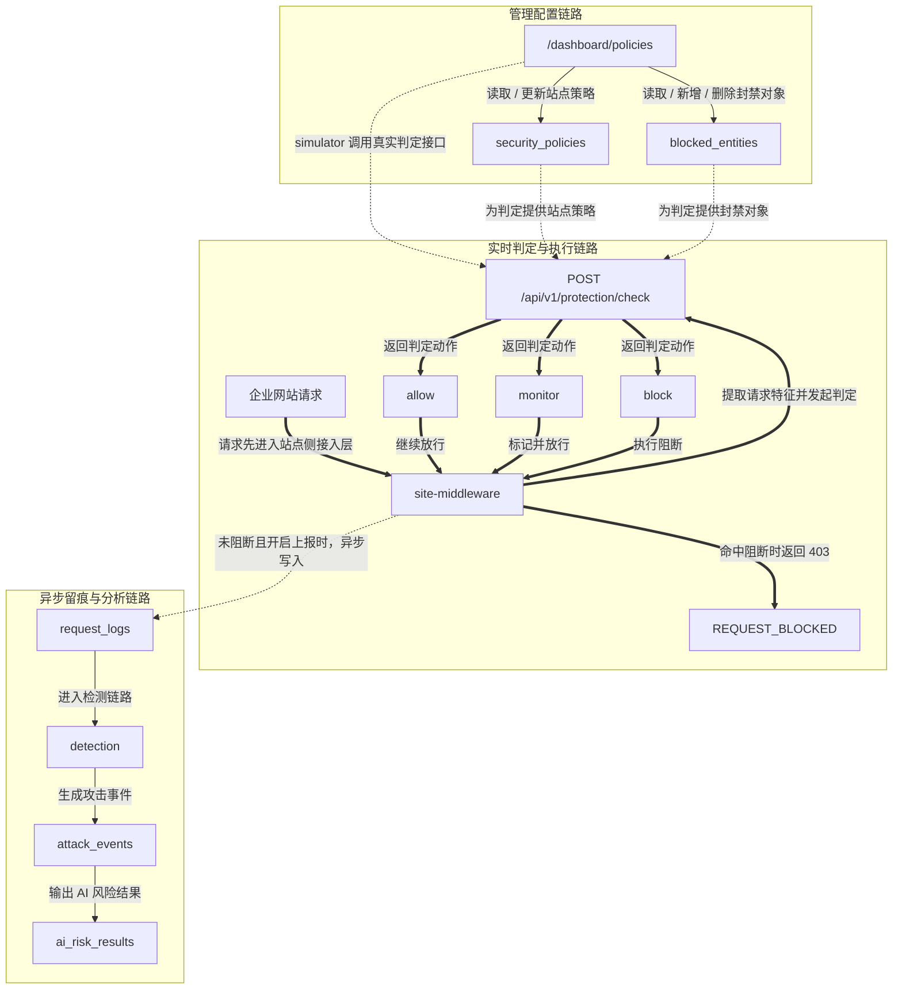

# 企业网站接入平台主链路图

这张图只描述当前仓库已经具备并验证过的真实链路，不包含 reverse proxy、full traffic gateway 或其他未落地能力。



## 图示说明

## 接入前统一入口

接入前默认先走两条仓库根目录统一入口：

```powershell
npm run dev:demo-stack
npm run smoke:demo-stack-ready
npm run doctor:demo-stack
```

统一口径：

- `dev:demo-stack` 负责拉起最小演示栈
- `smoke:demo-stack-ready` 负责确认接入、联调、演示前的整套栈已经 ready
- `doctor:demo-stack` 是统一失败排查主入口
- `demo:standard` 是统一标准演示入口
- 如果 `dev:demo-stack` 或 `smoke:demo-stack-ready` 失败，默认先执行 `npm run doctor:demo-stack`
- doctor 先只判断基础依赖、API、Web 是否 ready
- 如果 doctor 已确认基础栈正常，再只重跑对应失败的那一个子 smoke
- 如果基础栈已经 ready，且目标是标准演示而不是排查，直接执行 `npm run demo:standard`
- 不再默认要求手工拼接一长串启动和彩排命令

- 管理配置链路：
  - `/dashboard/policies` 是当前最小防护能力的管理入口。
  - 它负责维护站点级 `security_policies` 和 `blocked_entities`。
  - 页面里的 protection simulator 调用的也是同一个真实 `POST /api/v1/protection/check`。

- 实时判定与执行链路：
  - 企业网站请求先进入 `site-middleware`。
  - `site-middleware` 提取请求特征后调用 `POST /api/v1/protection/check`。
  - 判定接口会结合 `security_policies` 和 `blocked_entities` 返回 `allow / monitor / block`。
  - `site-middleware` 不自己维护独立规则，而是执行平台返回结果。
  - 当结果为 `block` 时，站点侧直接返回 `403 + REQUEST_BLOCKED`。

- 异步留痕与分析链路：
  - 当请求未被 `block`，且启用了 request log reporting 时，`site-middleware` 会异步写入 `request_logs`。
  - 这些日志继续进入 `detection -> attack_events -> ai_risk_results` 的主分析链路。
  - 这条链路和实时 enforcement 有关联，但不是同一个同步执行路径。

## 一句话版本

平台负责判定，`site-middleware` 负责执行，`/dashboard/policies` 负责管理与演示，`request_logs -> detection -> attack_events -> ai_risk_results` 负责异步留痕与分析。

##适合放在哪个文档里
README：适合放在“当前主链路”之后，作为“最小接入与防护主链路图”。
DEMO_GUIDE.md：适合放在“演示目标”后、“正式操作顺序”前，先统一观众对链路的理解。
答辩/PPT：适合单独占一页，标题可直接用“企业网站接入平台主链路”。
